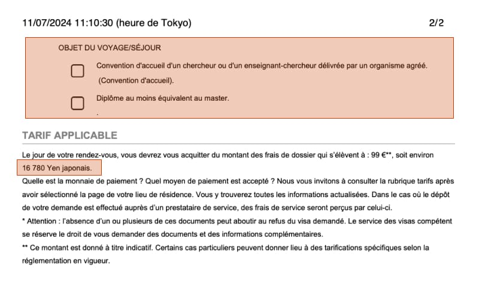
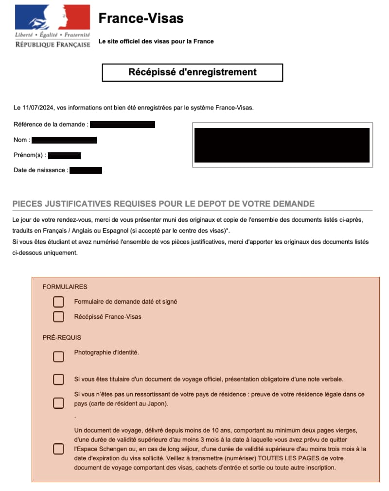
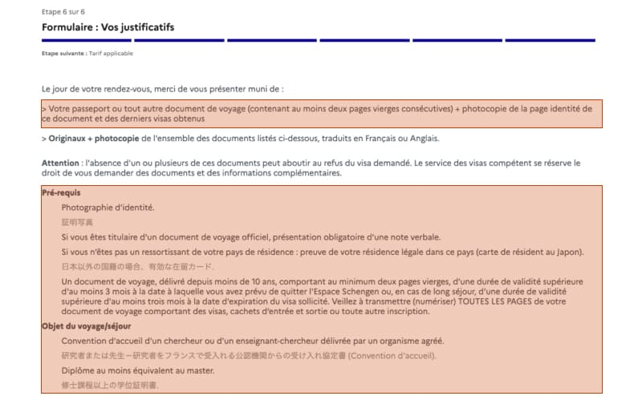
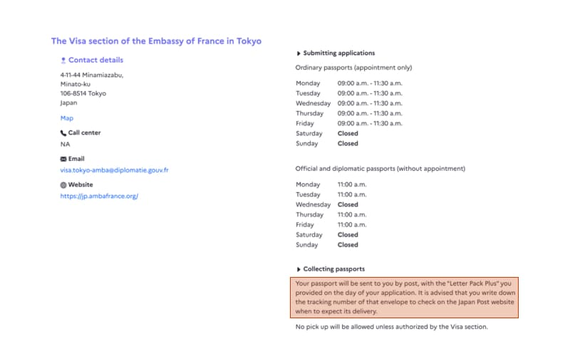

フランスでPhDに進む場合に必要な、研究者ビザ申請時に必要な書類について紹介します。
研究者ビザ申請の全体的な流れが知りたい場合は：

<a href="/posts/france_visa_todo" target="blank">

フランスの博士課程】研究者ビザ申請までの流れ（2024年）

フランスPhDメモ

/blog/posts/france_visa_todo/

</a>

## 目次

- [必要書類一覧](#必要書類一覧)
- [必要書類はどこに記載されているのか](#必要書類はどこに記載されているのか)
  - [申請書を書き終えた後の画面](#申請書を書き終えた後の画面)
  - [完成した申請書pdfの最終ページ](#完成した申請書pdfの最終ページ)
  - [france-visas.gouv.frの在日本フランス大使館のページ](#france-visasgouvfrの在日本フランス大使館のページ)

## 必要書類一覧
研究者ビザ(Passeport talent - Chercheur)の申請時に必要な書類は下記です：

- パスポート …(A) 
-  パスポートのコピー（顔写真があるページ）…(B) 
-  申請書（印刷し、証明写真を貼って、サインをする）…(C) 
-  証明写真（申請書に貼る）…(D) 
-  修士の修了証明書（英語）…(E) 
-  Convention d'accueil…(F) 
-  ビザ申請料 …(G)※2024/7時点では16,780円 ※お釣りが出ないように！ 
-  申請書チェックリスト（ダウンロードした申請書の最終ページにある）…(H) 
-  大使館予約確認書 …(I) 
-  レターパック（赤）…(J) 

### (A)パスポート, (B)パスポートのコピー
パスポートは博士の契約期間まで残存期間があることを確認してください。パスポートのコピーは、顔写真と名前などの情報が掲載されているページの見開きだけで大丈夫でした。（念の為全部コピーしましたが、不要でした。）

### (C)申請書
[france-visas.gouv.frのApplication Form](https://france-visas.gouv.fr/en/online-application)で作成が完了すると、PDFが出力されますので、ダウンロードして印刷します。PDFの構成は以下になっているかと思います：

- 申請書（３ページ）
- 謎の空白ページ（1ページ）
- 書類のチェックリスト（2ページ）

印刷後、申請書1ページ目の証明写真貼り付け箇所に、証明写真を貼り付けます。また、申請書の3ページ目最後にサインをします（下記画像赤マーカ部分）。Lieu et dateには"Tokyo, 日付"を記載し、 Signatureには、パスポート記載のサインと同じサインをします。
</a>

### (D)証明写真
- 証明写真のサイズ：パスポート同じ（35 x 45）
- 証明写真撮影時の注意点：[Schengen visa photograph instructions](https://www.diplomatie.gouv.fr/IMG/pdf/sample_photos_france.pdf)をご覧ください。

そして...証明写真は、申請書に貼ることを忘れないでください！

### (E)修士の修了証明書（英語）

ご自身の出身校にて、英語の修了証明書を発行してもらってください。

### (F)Convention d'accueil…

Convention d'accuei（研究機関または大学による受け入れ協定書）の入手方法：

<a href="/posts/france_visa_todo" target="blank">

フランスの博士課程】研究者ビザ申請までの流れ（2024年）

フランスPhDメモ

/blog/posts/france_visa_todo/#convention-daccueil受け入れ協定書の発行を先方に依頼

</a>

ちなみに、Convention d'accueilはビザ申請手続き完了後、郵送にてビザつきパスポートともに返却されます。

### (G)ビザ申請費用（16,780円　※2024年）
ビザ申請費用は99ユーロなのですが、円払いです。為替によって変わりますので、実際の金額はご自身のビザ申請書類の最後のページを確認して下さい（下記画像下部参照）。
</a>

円安の影響を受け、2024年7月に申請した私は16,780円でした（涙）2020年に申請したT.Hさんは12,453円だったようです...（参考：[【フランス生活】研究者ビザ取得から現地役所手続きの全て(2020年)](https://note.com/ifsttar_research/n/nc638e5d3dcf5)）

### (H)申請書類チェックリスト
[申請書](#c申請書)で記載した内容と同じですが、[france-visas.gouv.frのApplication Form](https://france-visas.gouv.fr/en/online-application)で申請書の作成が終わるとPDFが出力されます。そのPDFの最後2ページが申請書類チェックリストになっています。(下記画像参照)

### (I)大使館の予約確認書
[Appointment booking service with the French consular services （
Ambassade de France au Japon）](https://consulat.gouv.fr/en/ambassade-de-france-a-tokyo/appointment?name=Visa)で大使館の予約を済ませると、予約確認書がメールで送られてきます（下記画像参照）。こちらを印刷して、大使館に持参する必要があります。

フランス大使館予約の方法が知りたい方は[フランス大使館予約システムの使い方](../../posts/france_visa_flow/#フランス大使館予約システムの使い方)をご覧ください。

## 必要書類はどこに記載されているのか。
下記3ページを確認すれば、必要な書類が全て掲載されています：

- 申請書を書き終えた後の画面
- 完成した申請書（PDF）の最終ページ
- france-visas.gouv.frの在日本フランス大使館のページ

全部まとめて記載してくれておらず、さまざまなページに散らばっているのが不親切ですよね...

### 申請書を書き終えた後の画面
- 下記画像の赤マーカー（上部）：(A)パスポート, (B)パスポートのコピーが必要であることが記載されています。
- 下記画像の赤マーカー（下部）：(D)証明写真, (A)パスポート, (E)修士の修了証明書（英語）, (F) Convention d'accueilが必要であることが記載されています。
></a>

### 完成した申請書（PDF）の最終ページ
赤マーカー部分のチェックリスト上から：
1.  (C) 印刷し、サイン（場所・日付・名前）をした申請書
2.  (I) フランス大使館予約確認書
3.  (D) 証明写真
4.  公用旅券である場合は口頭で伝えること ※ほとんどの人が当てはまらないと思うので、無視で大丈夫です。
5. 日本国籍でない場合、日本の在留カード
6.  (A) パスポート

赤マーカー部分のチェックリスト上から：
1. (F) Convention d'accueil
2. (E)修士の修了証明書（英語）
3. (G) 16,780円

### france-visas.gouv.frの在日本フランス大使館のページ
レターパックは非常にわかりにくいのですが、ビザ申請サイトの在日本フランス大使館のページに小さく記載があります：

## 最後に
ざっと書いたので分かりにくいかもしれません。忘れないうちに残しておきたかったので、ゆっくり見直していきます...
間違っているところ・質問があれば、遠慮なく[こちら](https://forms.gle/QNzFbuAdrYB565GS8)から教えてください。

## 関連記事

<a href="/posts/france_visa_todo" target="blank">

【フランス研究者ビザ申請の流れ】研究室内定からビザ取得まで

フランスPhDメモ

/blog/posts/france_visa_todo

</a>

<a href="/posts/france_visa_duration/" target="blank">

何日かかる？ - 5日で届いたフランス研究者ビザ

フランスPhDメモ

/blog/posts/france_visa_duration/

</a>

