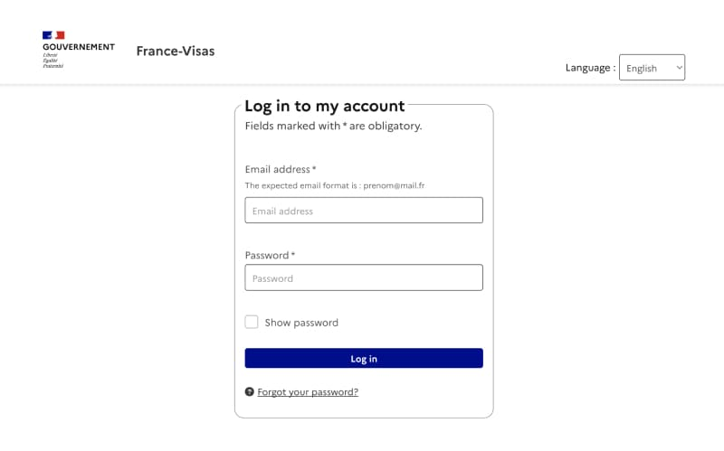
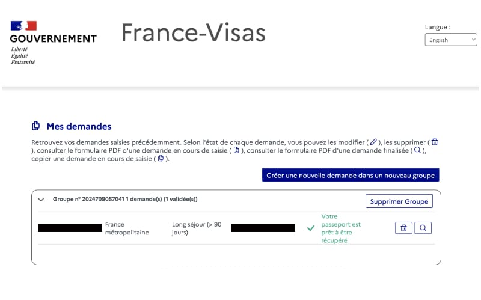

フランス大使館でのビザ申請から何日くらいでビザは届くのだろうか...？と気になっている人も多いかと思います。
私はフランス大使館が混雑する7月（正確には2024年7月18日（木曜））に申請して、5日後の7月23日（火曜）には家に届きました。つまり、土日を除けば<strong>3日でビザが手元に届いた</strong>ということになります。仕事はや...

  関連記事

  

<ul>
<li> 申請の流れ：<a href="../../posts/france_visa_flow/" target="blank">【フランスの博士課程】研究者ビザ申請までの流れ（2024年）</a></li>
<li> 必要書類：<a href="../../posts/france_visa_documents/" target="blank">【フランスビザ申請時の必要書類】博士課程・ポスドクへ進む方へ</a></li>
</ul>
  
 

## 目次

- [フランスのビザは受け取りまでの所要日数](#フランスのビザは受け取りまでの所要日数)
- [ビザ手続き進捗確認方法]()

## フランスのビザは受け取りまでの所要日数

冒頭で述べた通り、私はフランス大使館で申請をした<strong>5日後</strong>にレターパックで自宅に届きました。6~8月はフランスのセメスターに合わせて多くの方が渡仏するので、ビザ発給まで時間がかかる場合があると聞いていました。しかし私は、7/18に申請しましたが、5日後（営業日だけだと3日後）に届いたので、あまり関係はなさそうです。

大使館の混み具合や、書類の不備等でで所要日数は変わるようですが、インターネットで調べた限り、最短4日〜最長1ヶ月で届きそうです。参考までの他の方々の所要日数を紹介します：

### 研究者ビザ受け取りまでにかかった日数
下記２名の方は研究者ビザ発給までの所要日数について書いています。
- 2週間　※2020年8月（[フランスの研究者ビザ取得 – 大使館での申請 (2020年9月編) @Yuuki Wada Official Website](https://blog.yuuki-wd.space/archives/38)）
- 7日　※2017年（[フランスの研究者ビザについて @Yuya Matsumoto](http://yuyamatsumoto.com/francevisa.html)）

### 学生ビザの場合
下記の方は学生ビザ発給までの所要日数について書いています。
- 4日　※2021年？（[フランス渡航準備編:学生ビザ取得までの道のり（面接当日編）@なつさんのnote](https://note.com/phantomuwave/n/ne98838ccc8f4)）
- 3週間　※2022年（[@2022年度 留学近況報告書 (1)](https://www.meiji.ac.jp/cip/report/6t5h7p00000gfpn5-att/66_Middle_2022_FR_CatholiqueLille_LILLECampus.pdf)）

### ワーホリビザの場合
- 3日　※2023年？[フランス ワーキングホリデービザ取得記 【申請当日】@Deja?](https://ajed-deja.com/?p=758)
- 1週間 ※2015年[フランスのワーホリVISAを拒否された話 @世界中でゆきみダイエット](https://www.yukimidiet.com/entry/2018/12/16/224546#%E3%83%95%E3%83%A9%E3%83%B3%E3%82%B9%E3%83%AF%E3%83%BC%E3%82%AD%E3%83%B3%E3%82%B0%E3%83%9B%E3%83%AA%E3%83%87%E3%83%BCVISA%E9%80%9A%E3%82%89%E3%81%AA%E3%81%84)

## 研究者ビザ発給進捗確認方法

ビザ申請時に作成した[France-Visas](https://connect.france-visas.gouv.fr/realms/usager/protocol/openid-connect/auth?response_type=code&client_id=fv-fo-keycloak-web&scope=openid&state=e11bef0b-5ae9-457f-a783-edccbb7388b0&redirect_uri=http://application-form.france-visas.gouv.fr/fv-fo-dde/login/oauth2/code/keycloak&nonce=cZB_PJj9u3aFch4TaOhb2P5nb77YeyW4IFlpKz8e7f0)のサイトから確認できます。

まずはログインします。

下記の緑色文字部分が手続きの進捗です。フランス語で「パスポートの準備ができました」と表示されています。
> Votre passeport est prêt à être récupéré

</a>

ビザ発給手続き中の場合は、フランス語で「手続き中」と表示されていました。

## 最後に

フランスのビザ発給までの所要期間についてまとめました。間違っている部分や追記あれば、遠慮なく[こちら](https://forms.gle/QNzFbuAdrYB565GS8)から教えてください。

## 関連記事

<a href="/posts/france_visa_documents/" target="blank">

【必要書類】フランス研究者ビザ申請2024

フランスPhDメモ

https://julie-dayo.net/posts/france_visa_documents/

</a>

<a href="/posts/france_visa_todo" target="blank">

【フランス研究者ビザ申請の流れ】研究室内定からビザ取得まで

フランスPhDメモ

https://julie-dayo.net/posts/france_visa_todo

</a>

