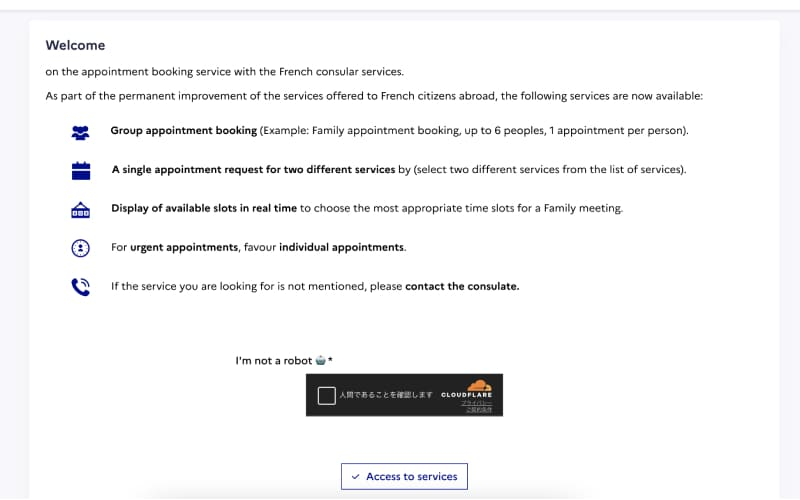
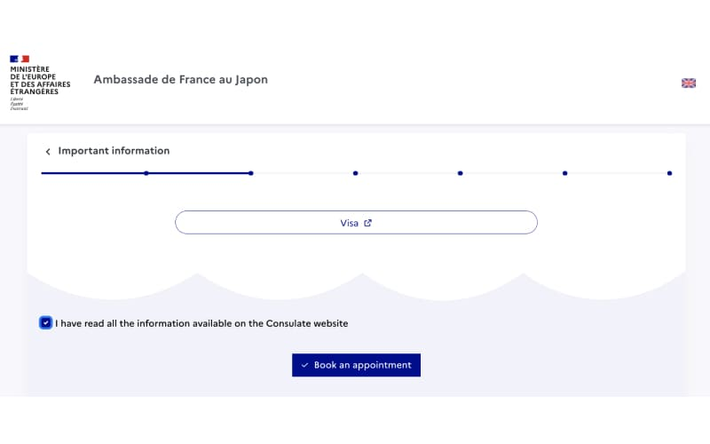
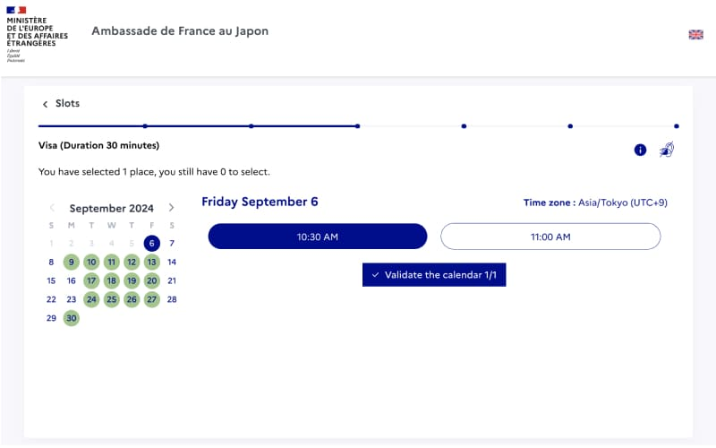
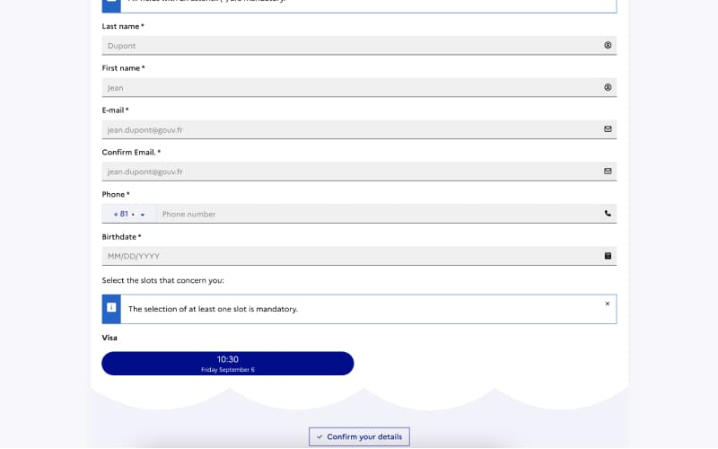
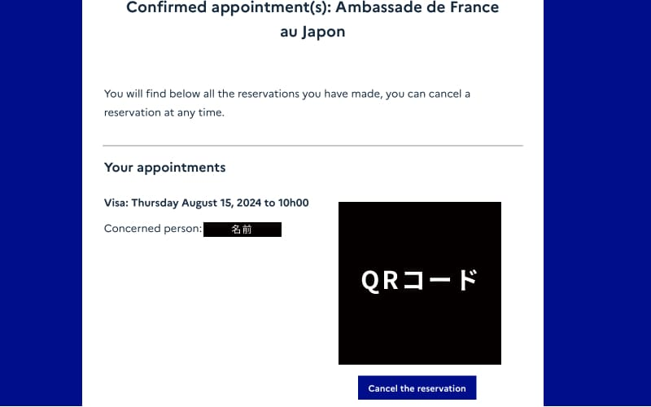

フランス大使館の予約システムの使い方を紹介します. １ヶ月後しか空きがない場合は, 毎日数時間おきにチェックすることで2,3日後の予約が取れます. 

「出国が迫っているのに, 予約が取れない」と焦っている方, 落ち着いでください. 私も出国ギリギリにしか予約できなかったのですが, 毎日予約システムをチェックすることで, 直近の空き時間を予約できました. 

## 目次
- [ビザ申請のためのフランス大使館の予約システム](#ビザ申請のためのフランス大使館の予約システム)
- [フランス大使館予約システムの使い方](#フランス大使館予約システムの使い方)
- [1ヶ月後しか空いていない！と焦っている方へ](#1ヶ月後しか空いていないと焦っている方へ)

## ビザ申請のためのフランス大使館の予約システム

研究者・学生・ワーホリなど, フランスのビザ申請書類はフランス大使館に直接持っていかなければなりません. 持って行く日は, 事前に専用の予約システムから予約しなければなりません. この記事では, 予約システムの使い方と, 出国が迫っているのに予約が取れない人向けに予約のコツ（？）を書いています. 

## フランス大使館予約システムの使い方
[Appointment booking service with the French consular services （
Ambassade de France au Japon）](https://consulat.gouv.fr/en/ambassade-de-france-a-tokyo/appointment?name=Visa)へアクセスします. 

### 1. 注意書きを読んで"Access to Serivice"へ進む

### 2. 注意書きページがもう一度出るので進む
注意書きを読んでから, "Book an appointment"をクリックして予約に進む

### 3. 希望日・時間を選択して進む
空き時間がある日程は, 左側のカレンダーで黄緑色になっています. いずれかをクリックすると, 空いている時間が右側に表示されます. 下図だと10:30と11:00に空きがあります. 都合が良い方を選び"Validate the calendar"をクリックします. 

### 4. 必要情報を入力
名前がパスポートと違ったり, ひらがなや全角で入力されていると, 予約はキャンセルとなるそうです. 
誕生日もパスポートと異なっていると, 予約がキャンセルになる可能性があるので, チェックは念入りに！

### 5. 予約確認メールが来る
必要情報を入力し終えると, 次の画面で予約確認書が表示されます. また同時にメールでも予約確認書が届きます. 
メールで届いた予約確認書は, 大使館に入館する際に必要なので印刷しましょう. 

## 1ヶ月後しか空いていない！と焦っている方へ
急遽ポジションが決まって, 7,8月で予約を取らないといけないという状況もあるかと思います. その場合は, 毎日[予約サイト](https://consulat.gouv.fr/en/ambassade-de-france-a-tokyo/appointment?name=Visa)をチェックして, 空き時間がないかを確認しましょう. 

意外と直前キャンセルする人がいるので, 2,3日後に急に空きが出たりします. 私は軽い気持ち（旅行の予定を優先・・・）で, 7/30の予約をキャンセルしたところ, 次回予約が9月初旬まで空いておらずヒヤヒヤしました（笑）1週間, 毎日2時間おきくらいに予約サイトをチェックし, 7/18の枠を予約することができました. 軽い気持ちでキャンセルするのはやめましょう. 

## 関連記事

<a href="/posts/france_visa_documents/" target="blank">

【必要書類】フランス研究者ビザ申請2024

フランスPhDメモ

/blog/posts/france_visa_documents/

</a>

<a href="/posts/france_visa_todo" target="blank">

【フランス研究者ビザ申請の流れ】研究室内定からビザ取得まで

フランスPhDメモ

/blog/posts/france_visa_todo

</a>

<a href="/posts/france_visa_duration/" target="blank">

何日かかる？ - 5日で届いたフランス研究者ビザ

フランスPhDメモ

/blog/posts/france_visa_duration/

</a>

