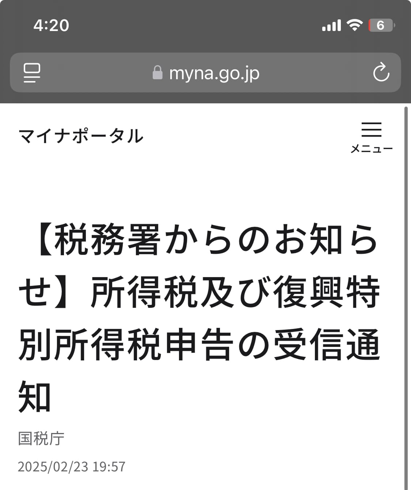
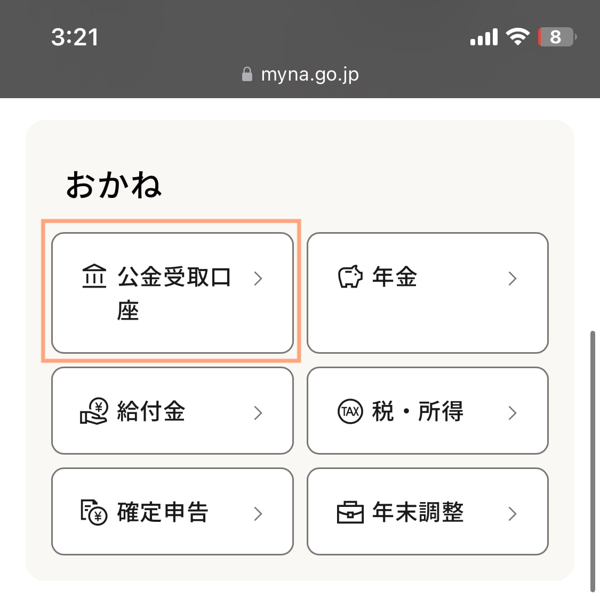
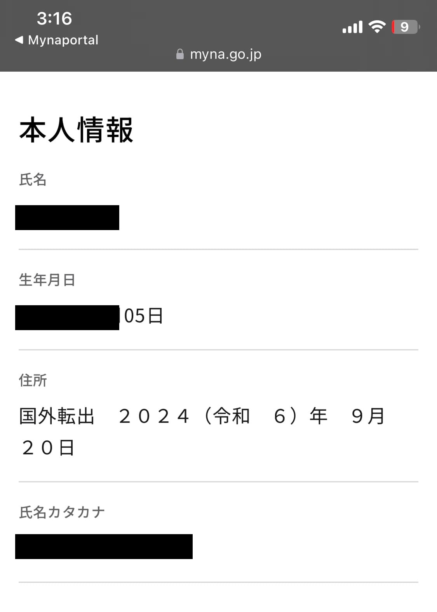

フランスからe-tax（マイナンバーカード利用）で確定申告ができました！そして、1ヶ月半後に、還付金の案内も届きました！非居住者の方が、マイナンバーカードを持てるようになったのは2024年。そのため情報が少なかったので、注意点などを、ここに書いておきます。確定申告の方法は日本で行うときと全く同じなので、確定申告の詳しい方法を知りたい方は他のサイトを見てください。

  私の状況

  

<ul>
  <li>〜2024年3月: 所属先の大学院でアルバイト（源泉徴収未済）</li>
  <li>2024年5月〜8月: フリーランスとして勤務（先方が源泉徴収）</li>
  <li>2024年9月中旬: フランスへ渡航（研究者ビザのため非居住者に） </li>
  <li>2024年10月〜: フランスの研究所で勤務開始（納税先はフランス） </li>
   <li>2025年2月: 2024年度分の確定申告作成 </li>
</ul>

## 目次

- [私の状況（2024年度分の日本での給料がある）](#私の状況2024年度分の日本での給料がある)
- [非居住者でも海外からe-taxを利用できた](#非居住者でも海外からe-taxを利用できる)
- [注意点](#注意点)
- [還付はいつ？：申請から1ヶ月半後](#還付はいつ)

## 私の状況（2024年度分の日本での給料がある）

先ほど記載した通り、私には2024年に受け取った給料、フリーランス時の経費、生命保険、国民保険・国民年金がありました。
それらの確定申告が必要でした。

  私の状況

  

<ul>
  <li>〜2024年3月: 所属先の大学院でアルバイト（源泉徴収未済）</li>
  <li>2024年5月〜8月: フリーランスとして勤務（先方が源泉徴収）</li>
  <li>2024年9月中旬: フランスへ渡航（研究者ビザのため非居住者に） </li>
  <li>2024年10月〜: フランスの研究所で勤務開始（納税先はフランス） </li>
   <li>2025年2月: 2024年度分の確定申告作成 </li>
</ul>

## 非居住者でも海外からe-taxを利用できた

日本にいるときと同じ方法で、マイナンバーカードとe-Taxを使用して、確定申告できました：
1. e-Tax登録
2. マイナポータル連携
3. e-Taxで必要書類作成、送信

※ 手順は日本で確定申告を行うときと全く同じなので、確定申告の方法は他のサイトを見てください。

私はe-tax上で、2025年02月23日に申請をしました。下記がマイナポータルで受信した確定申告完了のお知らせです。

## 注意点
日本でe-taxから確定申告するときと手順は同じですが、注意点がいくつかあります。
### 連絡先
- 日本の電話番号のみ
- 日本の住所のみ

日本の電話番号や住所がない方は、日本の親族なり、納税管理人を届出している方はその方の連絡先にするなり、した方が良いです。
メールアドレスの記載欄もあります。最終確認画面で備考欄があるので、「海外在住のため連絡先はメールアドレスにお願いします」と記載することを推奨します。

### 振り込み口座
- 海外の銀行口座は不可
- 本人名義の日本口座限定

非居住者は原則日本の銀行口座を持てないので、口座を持っていない人もいるかもしれません。
非居住者が唯一持てる銀行がいくつかあるので、それらを作っておいて、登録するのが良いと思います。ちなみに私はソニー銀行です。

### 納税管理人の選定
必須かどうかはわかりません。納税管理人は、簡単に言うと、非居住者の方の代わりに、税のやり取り等をする人です。家族等で構いません。e-taxで申請できなかった頃は、こちらは必須であったはずです。ただ、e-taxで確定申告できるようになっているので、今はどうなのか分かりません。
> <strong>納税管理人</strong>：非居住者の方が、確定申告書の提出、税務署等からの書類の受け取り、税金の納付や還付金の受け取り等、納税義務を果たすために納税管理人を定める必要があります。 引用元：[海外勤務と納税管理人の選任又は解任(国税庁）
](https://www.nta.go.jp/taxes/shiraberu/taxanswer/shotoku/1923.htm)

私は海外からは、e-taxで確定申告できないと思っていたので、2024年度分の確定申告は日本にいる親族にやってもらおうと思っており、出国前に手続きを済ませておりました。

<strong>（2025年4月7日更新）</strong>
納税管理人を定めていたがために、還付金のお知らせは日本にいる納税管理人（夫）のもとに届きました。また、マイナポータル上での還付金振り込み口座は私なのに対して、納税管理人は夫になっていたため、納税管理人（夫）名義の銀行口座を教えてくださいという手紙も届きました...もしかして、納税管理人を決めておかないほうが、このような手間はなかったかもしれません（？）ただ、万が一何かあった時に、日本で連絡取れる人がいたほうが安心ですよね...

## 必要なもの
### マイナンバーカード
マイナンバーカードは海外転出時に、継続利用（？）の手続きが必要だった気がします...（無料）

### マイナポータル
マイナポータルで海外転出できているかどうか確認できます。

1. マイナポータルにログインし、「公的受け取り口座」をタップ

2. 住所欄を確認すると、「国外転出X年X月X日」となっているはず

### e-tax
e-taxでアカウントの作成が必要です。

### 日本の銀行口座
非居住者が所持できる日本の銀行は"[海外赴任しても使える銀行口座6選！非居住者向けサービス・手数料解説（Wise）](https://wise.com/jp/blog/moving-abroad-bank-account)"で紹介されています。

## 還付はいつ？
還付の案内が4月7日に届きました。eTaxで申請をしたのが2月23日なので、およそ1ヶ月半後です。前述の通り、私は納税管理人を定めていたせいか、通知の案内は日本にいる納税管理人（夫）の元に届きました。また、納税管理人を定めていた場合は、還付金受取人は納税管理人のようです。そのため納税管理人（夫）の銀行口座情報を提供してくださいという案内も、夫の元に届きました。これらを考えると、納税管理人を定めないほうが良いのか？と思ったりもしますが、念の為定めておいたほうがよさそうな気もします。

完全に振り込まれたら、また更新します。ひとまず還付金の通知が来たので、振り込まれることは確実です。

